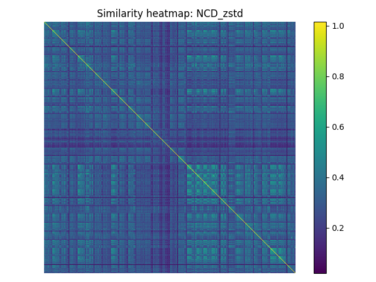
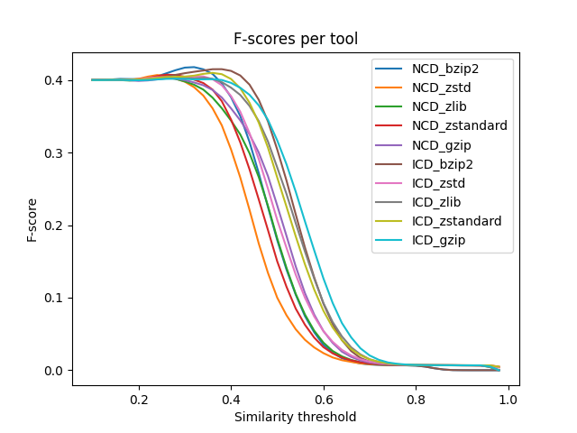

# Code Similarity

This project was developed as part of a course at the Technical University of Denmark (DTU).

The repository contains a CLI tool for benchmarking and comparing different methods of measuring source code similarity (similarity tools), primarily based on Normalized Compression Distance (NCD) and Inclusion Compression Divergence (ICD) as described in the paper [A comparison of code similarity analysers](https://doi.org/10.1007/s10664-017-9564-7) by Ragkhitwetsagul et al.

The CLI tool has the following features:

1. Creating heatmaps showing the pairwise similarity scores between Java source code files from the [Project CodeNet Java250](https://developer.ibm.com/data/project-codenet/) dataset.


2. Plotting F-scores of different similarity tools in a comparative line chart.


## Requirements

- python version >= 3.12 \
  NOTE: It may be possible to use older versions of python, but this was the version used during development.

## Setup

To use the tool contained in this repository, follow this setup:

1. Install the required python libraries specified in the requirements.txt file, e.g.\
``pip install -r requirements.txt``
2. Download the [Project CodeNet Java250](https://developer.ibm.com/data/project-codenet/) dataset and place the unzipped Project_CodeNet_Java250 folder in the root of this project, i.e. at the same level as this README.

## Usage

The CLI tool is envoked by executing ``main.py``. The following options are available:

| Argument                      | Type         | Explanation |
|-                              |-             |-|
| Positional (required)         |              | |
| ``num_dirs``                  | ``int``      | Number of directories to process from the dataset. |
| ``num_files``                 | ``int``      | Number of files to process in each directory. |
| Options                       |              | |
| ``-C``, ``--compressors``     | Multi-choice | Specify compressor(s). Options: [bzip2, gzip, zlib, zstandard, zstd]. |
| ``-NCD``                      | Flag         | Use Normalized Compression Distance (NCD) for similarity calculation. |
| ``-ICD``                      | Flag         | Use Inclusion Compression Divergence (ICD) for similarity calculation. |
| ``-PH``, ``--PLOT_HEATMAP``   | Flag         | Generate heatmaps of the similarity matrices. |
| ``-PF``, ``--PLOT_FSCORES``   | Flag         | Plot F-scores for the similarity tools. |
| ``-NO-CL``, ``--NO_CLUSTER``  | Flag         | Disable clustering of the similarity matrices. |
| ``-h``, ``--help``            | Flag         | Show this help message and exit. |

For example, creating heatmaps for the first 10 files in the first 5 directories of the Java250 dataset using NCD-based similarity tool with bzip2 and zstd:
```sh
py src/main.py 5 10 -NCD -C bzip2 zstd -PH
```

## Development

### Creating requirements.txt
Use pipreqs. Docs: <https://github.com/bndr/pipreqs>

```sh
# Install pipreqs 
pip install pipreqs

# Create requirements.txt
pipreqs .\src --force --savepath requirements.txt
```
